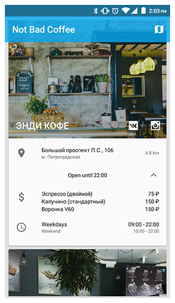
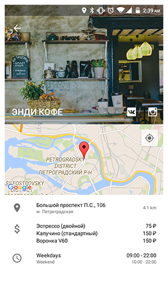

Not Bad Coffee for Android
========

An prototype Anroid application for the [Not Bad Coffee][1].

  

License
--------

    Not Bad Coffee for Android.
    Copyright (C) 2016 Alexey Leshchuk.

    This program is free software: you can redistribute it and/or modify
    it under the terms of the GNU General Public License version 2,
    as published by the Free Software Foundation.

    This program is distributed in the hope that it will be useful,
    but WITHOUT ANY WARRANTY; without even the implied warranty of
    MERCHANTABILITY or FITNESS FOR A PARTICULAR PURPOSE.  See the
    GNU General Public License for more details.

    You should have received a copy of the GNU General Public License
    along with this program. If not, see http://www.gnu.org/licenses/.

[1]: http://notbadcoffee.com